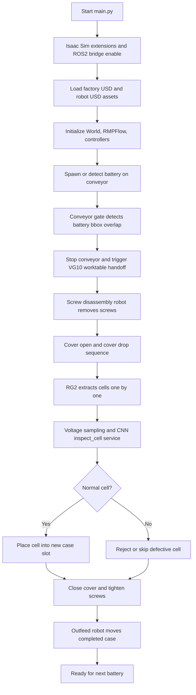

# Battery Factory Digital Twin Submission

## 1. 프로젝트 개요

본 워크스페이스는 Isaac Sim 기반 배터리 팩 재제조/검사 공정 디지털 트윈이다.
컨베이어로 투입된 배터리를 다중 M0609 로봇이 순차 처리하며, 흡착 그리퍼와 RG2 그리퍼를 이용해 배터리 이송, 커버 분해, 셀 추출, CNN 외형 검사, 정상 셀 적재, 케이스 배출까지 하나의 시나리오로 통합한다.

검증 목표는 다음과 같다.

- 다중 로봇 작업 순서를 충돌 없이 조율한다.
- 컨베이어 센서와 ROS2 서비스 이벤트로 공정 전환을 자동화한다.
- 셀 전압 및 CNN 외형 검사 결과를 로봇의 적재/폐기 결정에 반영한다.
- 반복 Play/Stop 및 재실행 시 동일한 초기 상태에서 시뮬레이션을 재현한다.

## 2. 시스템 설계

주요 구성 요소는 다음과 같다.

- Isaac Sim world: 공장, 컨베이어, 작업대, 팔레트, 배터리 케이스, 로봇 배치
- M0609 + VG10: 팔레트 적재, 작업대 이송, 출고 이송
- M0609 + screwdriver/RG2: 나사 분해, 커버 분해, 셀 추출, 나사 체결
- ROS2 bridge: `std_srvs/Trigger`, image topic, simulation clock
- AI vision node: top/side camera image를 CNN으로 판정하고 `inspect_cell` 서비스로 결과 제공
- Controller modules: 각 로봇 공정을 FSM/phase 단위로 분리하고 `main.py`에서 순차 통합
- Story UI: `/rosout` 로그를 구독해 공정 단계, 검사 결과, 양품 셀 및 재조립 상태를 웹 애니메이션으로 시각화

## 3. 플로우 차트



## 4. 운영체제 및 실행 환경

- OS: Ubuntu 22.04 LTS
- ROS2: Humble
- Isaac Sim: Isaac Sim 5.x 계열
- Python: Isaac Sim bundled Python 및 ROS2 Humble Python 환경
- GPU: NVIDIA GPU 권장
- 실행 방식: Isaac Sim `python.sh`로 `src/rokey_d2_gamin_4/main.py` 실행

환경 변수 예시:

```bash
source /opt/ros/humble/setup.bash
export RMW_IMPLEMENTATION=rmw_fastrtps_cpp
export CELL_INSPECTION_DEVICE=cpu
```

## 5. 사용 장비 목록

- Doosan M0609 manipulator 다수
- OnRobot VG10 suction gripper
- OnRobot RG2 gripper
- Screwdriver end-effector
- Conveyor belt and trigger sensor area
- Work table, pallet, outfeed station
- Top/side RGB camera for cell inspection
- Battery case, battery cover, screw, cell USD assets

## 6. 의존성

Python 의존성은 루트의 `requirements.txt`에 정리되어 있다.
Isaac Sim/ROS2에서 기본 제공되는 `isaacsim`, `omni`, `pxr`, `rclpy`, `sensor_msgs`, `std_srvs` 계열은 별도 pip 설치 대상이 아니라 환경 설치 대상이다.

주요 pip 패키지:

- numpy
- scipy
- pyyaml
- pillow
- torch
- torchvision
- opencv-python

UI 서버는 Python 표준 라이브러리와 ROS2 Humble의 `rclpy`, `rcl_interfaces`를 사용한다. 두 ROS 패키지는 `pip`가 아니라 ROS2 환경에서 제공되므로 UI 실행 전에 `/opt/ros/humble/setup.bash`를 source해야 한다.

## 7. 실행 순서

### 7.1 CNN 검사 노드 실행

별도 터미널에서 실행한다.

```bash
cd battery_factory_submission_ws
source /opt/ros/humble/setup.bash
python3 src/cnn/cell_inspection_node.py
```

또는 스크립트 사용:

```bash
./scripts/run_cnn_inspection.sh
```

### 7.2 Isaac Sim 메인 시뮬레이션 실행

Isaac Sim 설치 경로를 환경 변수로 지정한 뒤 실행한다.

```bash
cd battery_factory_submission_ws
export ISAAC_SIM_PYTHON=/home/rokey/dev_ws/isaac_sim/isaacsim/_build/linux-x86_64/release/python.sh
$ISAAC_SIM_PYTHON src/rokey_d2_gamin_4/main.py
```

또는 스크립트 사용:

```bash
export ISAAC_SIM_PYTHON=/path/to/isaacsim/python.sh
./scripts/run_main_isaac.sh
```

### 7.3 공정 모니터링 UI 실행

별도 터미널에서 UI 서버를 실행한다. 기본 포트는 `8107`이며 첫 번째 인자로 변경할 수 있다.

```bash
cd battery_factory_submission_ws
chmod +x src/ui/run_ui.sh
./src/ui/run_ui.sh 8107
```

브라우저에서 다음 주소로 접속한다.

```text
http://127.0.0.1:8107
```

`run_ui.sh`는 `/opt/ros/humble/setup.bash`가 있으면 자동으로 source하고 `/rosout`을 구독한다. 시뮬레이션과 UI가 같은 ROS2 그래프를 사용하도록 필요시 실행 전에 환경 변수를 맞춘다.

```bash
export ROS_DOMAIN_ID=141
export ROS_LOCALHOST_ONLY=0
./src/ui/run_ui.sh 8107
```

기본 실행은 로컬 로그 파일을 읽지 않는다. ROS2 로그와 함께 특정 로그 파일도 읽어야 하는 경우에만 파일 경로를 지정한다.

```bash
export BATTERY_PROJECT_LOG=/path/to/project.log
./src/ui/run_ui.sh 8107
```

UI는 상태 확인 전용이며 로봇이나 시뮬레이션에 제어 명령을 보내지 않는다. 종료는 UI 서버가 실행 중인 터미널에서 `Ctrl+C`를 누른다.

## 8. 주요 파일 구조

```text
battery_factory_submission_ws/
├── README.md
├── requirements.txt
├── scripts/
│   ├── run_cnn_inspection.sh
│   └── run_main_isaac.sh
└── src/
    ├── basic/
    ├── cnn/
    │   ├── cell_inspection_node.py
    │   └── cell_dataset/*.pt
    ├── ui/
    │   ├── README.md
    │   ├── index.html
    │   ├── main.js
    │   ├── run_ui.sh
    │   ├── server.py
    │   └── style.css
    └── rokey_d2_gamin_4/
        ├── main.py
        ├── controller/
        ├── docs/
        ├── rmpflow/
        ├── urdf/
        ├── usd/
        ├── bad_cell_battery_usd/
        ├── screw_disassembly/
        ├── screw_tightening/
        └── suction_cover_close/
```

## 9. 시뮬레이션 에셋 및 실행 파일

- 메인 실행 파일: `src/rokey_d2_gamin_4/main.py`
- 메인 factory USD: `src/rokey_d2_gamin_4/usd/factory/factory_clean_2.usd`
- 로봇 USD:
  - `src/rokey_d2_gamin_4/usd/m0609/m0609_camera_cube.usd`
  - `src/rokey_d2_gamin_4/usd/m0609/m0609_vg10_cube.usd`
  - `src/rokey_d2_gamin_4/usd/m0609/m0609_screw_cube.usd`
- URDF/RMPFlow:
  - `src/rokey_d2_gamin_4/urdf/m0609_isaac_sim.urdf`
  - `src/rokey_d2_gamin_4/rmpflow/m0609_description.yaml`
  - `src/rokey_d2_gamin_4/rmpflow/m0609_rmpflow_common.yaml`
- 컨트롤러 코드: `src/rokey_d2_gamin_4/controller/*.py`
- AI 검사 코드: `src/cnn/cell_inspection_node.py`
- AI 모델: `src/cnn/cell_dataset/cell_classifier_final.pt`

## 10. ROS2 패키지 및 노드

이 제출본의 ROS2 연동은 별도 custom message package 없이 Isaac Sim Python과 ROS2 표준 패키지를 사용한다.

- 사용 ROS2 package: `rclpy`, `std_srvs`, `std_msgs`, `sensor_msgs`, `geometry_msgs`
- 주요 서비스:
  - `inspect_cell`: CNN 셀 외형 검사
  - 각 공정 Trigger 서비스: VG10, screw disassembly, cover drop, grip cell, outfeed 등
- 주요 이미지 토픽:
  - `/worktable_top_rgb`
  - `/worktable_side_rgb`
- 모니터링 UI:
  - `src/ui/server.py`가 `/rosout`의 `rcl_interfaces/msg/Log`를 구독
  - `GET /api/status`로 브라우저에 최신 공정 상태 제공
  - 정적 UI 및 공정 애니메이션은 `src/ui/index.html`, `main.js`, `style.css`에서 제공

## 11. 제출 압축 기준

본 zip은 원본 workspace의 `build`, `install`, `log`, `.git`, Python cache, 디버그 캡처를 제외하고 생성했다.
실행에 필요한 Python 코드, ROS2 연동 코드, USD/URDF/YAML 에셋, CNN 모델 파일은 포함되어 있다.
